# Installation & Configuration

Custom Task Template plug-ins must be copied to the Automation Framework folder of your SAP BI platform server.  
The content can be deployed using the the Central Management Console, configuration will be done in the BI Administration Console.

### Table of Contents  
[Preparation](#prepare)  
[Install plug-ins](#install)  
[Deploy content](#deploy)  
[Check content](#check)    
[Configuration](#configuration)  

<a name='prepare'>  

## Preparation  
Clone or download the sample project.
If you download the ZIP, please extract the files.  
You will use the files from folder `..\deploy` in the next steps.

<a name='install'>  

## Install plug-ins  
1. Copy the Custom Task Template plug-ins to your system.  
   **Source**:  `<your folder>\deploy\plugins\*.jar`
   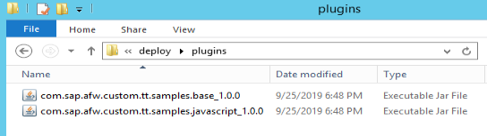  
   
   **Target**: `<BOE folder>\AdminConsole\Agent\plugins\task_bundle`
   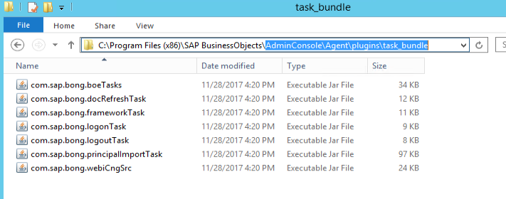  
   
 1. The BI Agent service should use the new task template plug-ins without restart, but we recommend to restart to service.  
    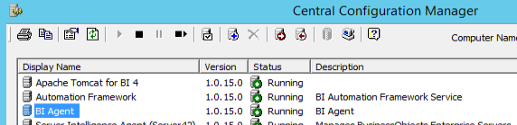  
    
<a name='deploy'>  

## Deploy content
Import the content using the Promotion Management of the CMC.
1. Open the CMC  
1. Select Promotion Management  
  
1. Select Menu &gt; Import &gt; Import file - choose Browse  
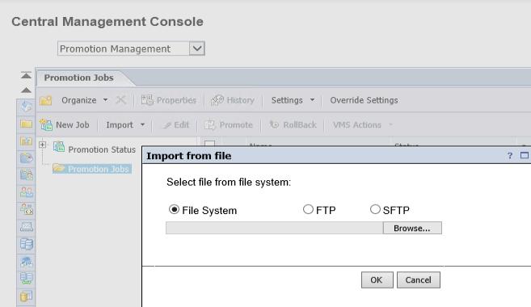  

1. Select the sample content file (LCMBIAR) - choose Open - choose Ok  
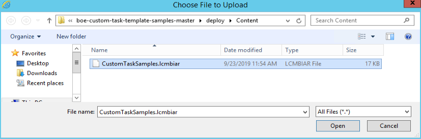  

1. Enter your System as Destination - choose Create  
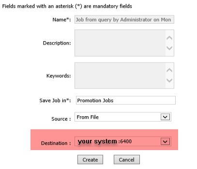  

1. Select Menu &gt; Promote - choose Promote  
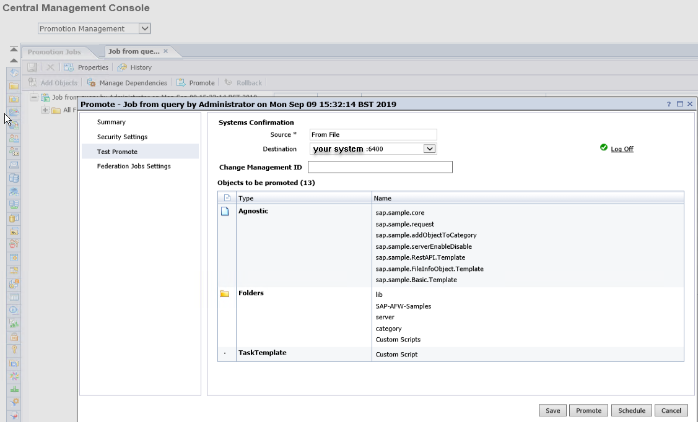  

<a name='check'>  

## Check content

To check if the import was successful.  
1. Select the Job in the list - choose Menu &gt; History  
The status should be success
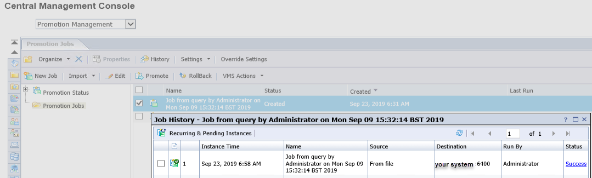  

1. From CMC Home or dropdown &gt; select BI Administration Console - choose Task Template - choose Custom  
All available Custom Task Templates will be listed
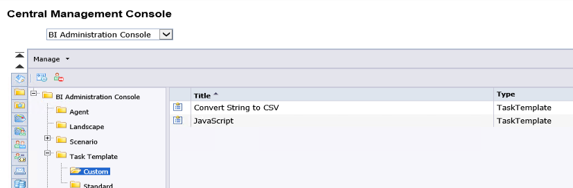  

1. From CMC Home or dropdown &gt; select Folders - choose SAP-AFW-Samples - choose Custom Scripts  
The JavaScript samples will be listed
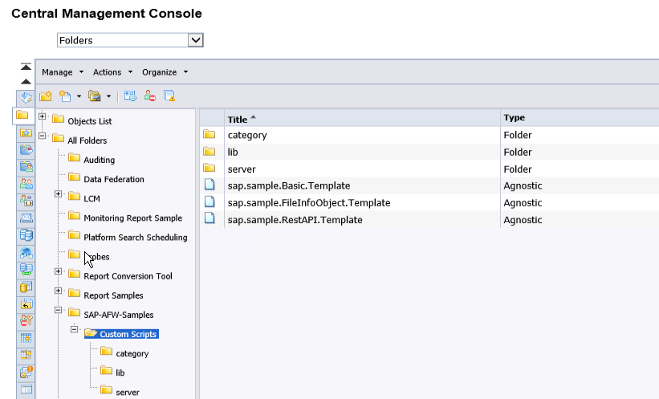  

<a name='configuration'>  

## Configuration
Set the Landscape configuration in the BI Administration Console.
1. Select Landscape Management  
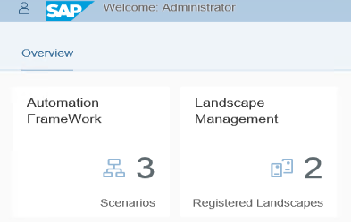  

1. From the landscape list
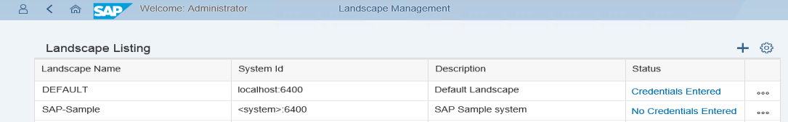  

1. Edit the samples landscape and enter the system parameters
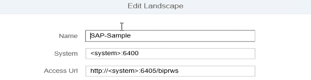  
  
1. Enter the users credentials for the landscape  
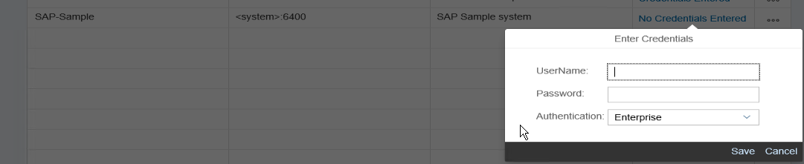  

   The credentials are stored for the user who is currently logged in to the Administration Console.
   If another user wants to execute scenarios, he must also enter the credentials for the landscape.

