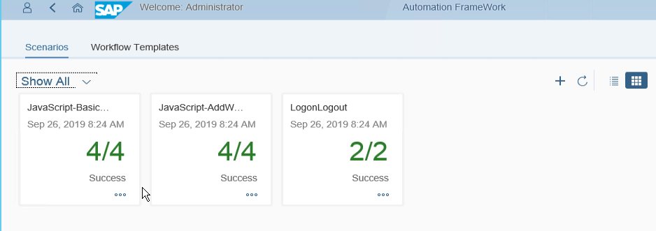

# Learning

[How to use the samples](#how)  
[Sample Scenarios](#sceanrios)
[Sample Workflow Templates](#wfts)  
[Sample JavaScripts](#javascripts)  
[Sample Plugins](#plugins)  

<a name='how'>

### How to use the samples

The sample `Scenarios` can be executed using the Automation Framework.  
  

<a name='scenarios'>

### Sample Scenarios

  Scenario          | Description
  ----------------- | -------------------------------------------------------------------------------------------------
  LogonLogout       | Test the logon to the *SAP-Sample* system  
  JavaScript-BasicTemplate | Query a list of Users and generate Scenario results using JavaScript
  JavaScript-AddWebiSamplesToCategory  |  Query a list of Web Intelligence documents and add them to a global cateogory  
  CompareWebiDatasets | Compare the data from a table in a Web Intelligence document (before and after refresh)  
  CompareRef_WebiDataset | Compare data from a CSV File with data from table in a Web Intelligence document  
  CompareRef_WebiDataset(Changed) | like previous scenario, but reference data was changed
  GetWebiWorklist-RefreshDocs | Get the worklist of documents from a Web Intelligence report table, refresh the documents
  

<a name='wfts'>

### Sample Workflow Templates

Since only `Workflow Templates` can be used in `Scenarios`, they are part of the sample content.
(in future releases, it is planned to support the direct usage of task templates in scenarios).  

  WFT                      | Description
  ------------------------ | --------------
sap.samples.wft.JavaScript | combine Task Templates `Convert String to CSV` and `JavaScript`
sap.samples.tt.&lt;name&gt;  | Workflow Template for a Task Template, e.g. `Query Worklist`, `Get WebIntelligence Dataset `

<a name='javascripts'>

### JavaScripts  

  Area              | Description
  ----------------- | ----------------------------------------------
  category | add Objects to a corporate category
  server   | enable / disable Servers  
  lib      | library code to be used in other JavaScripts

<a name='plugins'>

### Plug-ins and Custom Task Templates

  Task Template | Description | Plugin
  ----------------- | ---------------------------------------------- | ---------------------------------------
  Convert String to CSV | Convert input parameter (String) to output parameter (CSV) | &lt;id&gt;base_&lt;version&gt;.jar   
  Compare String | Simple string compare of CSV values  
  Get WebIntelligence Dataset | Get the values from a table in a report of a Web Intelligence document  
  Get WebIntelligence Worklist | Get the values from a table in a report of a Web Intelligence document as worklist in CSV format
  JavaScript | execute JavaScript code from a document uploaded to a folder in the CMS repository | &lt;id&gt;javascript_&lt;version&gt;.jar  

